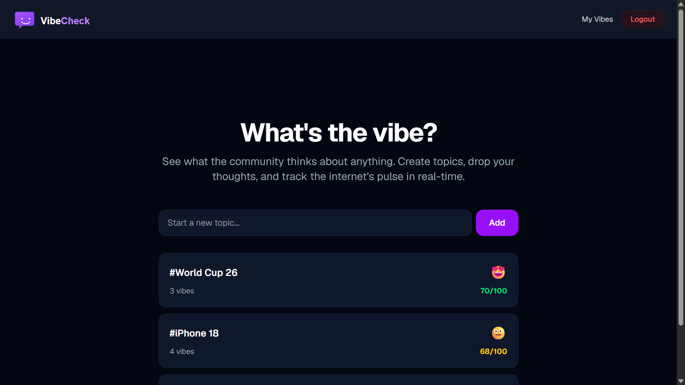
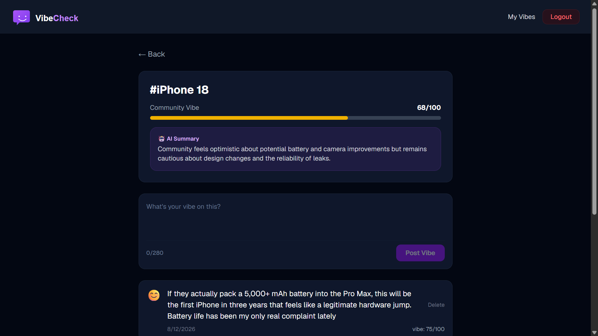

# VibeCheck ✨

> A community sentiment platform where users post their opinions on topics and AI analyzes the collective mood in real time.

---

## 🌐 Live Demo

[vibecheck.app](https://lets-vibe-check.vercel.app/)

---

## 📸 Screenshots



> **Home Page** — Browse trending topics with AI vibe scores

<br />



> **Topic Page** — Community posts with AI mood summary

---

## 🚀 Features

- 🔐 **JWT Authentication** — Secure register and login
- 💬 **Community Posts** — Share your opinion on any topic (280 chars)
- 🤖 **AI Sentiment Analysis** — Every post is automatically scored 0-100 by Groq LLM
- 📊 **AI Mood Summary** — Topic pages show an AI-generated community mood summary
- 📈 **Vibe Score** — Each topic displays a real-time community vibe score
- 👤 **User Dashboard** — View all your posts and personal sentiment stats
- 🗑️ **Delete Posts** — Users can delete their own posts
- 🐳 **Dockerized** — Full stack runs with a single command

---

## 🛠️ Tech Stack

### Backend

| Technology        | Purpose               |
| ----------------- | --------------------- |
| FastAPI (Python)  | REST API framework    |
| PostgreSQL        | Database              |
| SQLAlchemy        | ORM                   |
| JWT (python-jose) | Authentication        |
| Groq LLM API      | AI sentiment analysis |
| Docker            | Containerization      |

### Frontend

| Technology   | Purpose             |
| ------------ | ------------------- |
| React + Vite | Frontend framework  |
| TypeScript   | Type safety         |
| Tailwind CSS | Styling             |
| shadcn/ui    | UI components       |
| Axios        | HTTP client         |
| React Router | Client-side routing |

---

## 🏗️ Project Structure

```
vibecheck/
├── backend/
│   ├── main.py           # FastAPI app entry point
│   ├── models.py         # Database models
│   ├── schemas.py        # Pydantic schemas
│   ├── auth.py           # JWT authentication
│   ├── ai.py             # Groq AI integration
│   ├── database.py       # Database connection
│   ├── routers/
│   │   ├── auth.py       # Auth endpoints
│   │   ├── topics.py     # Topics & posts endpoints
│   │   └── users.py      # User dashboard endpoint
│   ├── Dockerfile
│   └── requirements.txt
├── frontend/
│   ├── src/
│   │   ├── api/          # API client & types
│   │   ├── components/   # Reusable components
│   │   ├── context/      # Auth context
│   │   └── pages/        # Home, Topic, Auth, Dashboard
│   └── Dockerfile
├── docker-compose.yml
└── README.md
```

---

## ⚙️ Getting Started

### Prerequisites

- Docker & Docker Compose installed
- Groq API key (free at [console.groq.com](https://console.groq.com))

### 1. Clone the repo

```bash
git clone https://github.com/yourusername/vibecheck.git
cd vibecheck
```

### 2. Set up environment variables

```bash
# Create backend/.env
cp backend/.env.example backend/.env
```

Fill in your values:

```bash
DATABASE_URL=postgresql://postgres:password@db:5432/vibecheck
SECRET_KEY=your-secret-key-here
ALGORITHM=HS256
ACCESS_TOKEN_EXPIRE_MINUTES=1440
GROQ_API_KEY=your-groq-api-key-here
```

### 3. Run with Docker

```bash
docker-compose up --build
```

### 4. Open the app

```
Frontend  → http://localhost:3000
API Docs  → http://localhost:8000/docs
```

---

## 📡 API Endpoints

| Method | Endpoint             | Description                  | Auth |
| ------ | -------------------- | ---------------------------- | ---- |
| POST   | `/auth/register`     | Register new user            | ❌   |
| POST   | `/auth/login`        | Login                        | ❌   |
| GET    | `/topics`            | Get all topics               | ❌   |
| POST   | `/topics`            | Create a topic               | ✅   |
| GET    | `/topics/{id}/posts` | Get topic posts + AI summary | ❌   |
| POST   | `/topics/{id}/posts` | Post a vibe                  | ✅   |
| DELETE | `/posts/{id}`        | Delete a post                | ✅   |
| GET    | `/users/me`          | Get user dashboard           | ✅   |

---

## 🤖 How the AI Works

```
User posts "This phone is overpriced and slow"
              ↓
Groq LLM (llama model) analyzes sentiment
              ↓
Returns score: 18/100 (very negative)
              ↓
Saved to database with the post

When topic page is opened:
  Last 20 posts → sent to Groq LLM
              ↓
  AI generates 2-sentence mood summary
  + overall vibe score 0-100
              ↓
  Cached in database until next post/delete
```

---

## 🔒 Environment Variables

| Variable                      | Description                  |
| ----------------------------- | ---------------------------- |
| `DATABASE_URL`                | PostgreSQL connection string |
| `SECRET_KEY`                  | JWT signing secret           |
| `ALGORITHM`                   | JWT algorithm (HS256)        |
| `ACCESS_TOKEN_EXPIRE_MINUTES` | Token expiry time            |
| `GROQ_API_KEY`                | Groq API key for AI features |

---

## 👤 Author

**Mohammad Hadi Elabed**

- LinkedIn: [linkedin.com/in/mohammad-hadi-elabed](https://linkedin.com/in/mohammad-hadi-elabed)
- GitHub: [github.com/yourusername](https://github.com/MH5034)

---

## 📄 License

MIT
