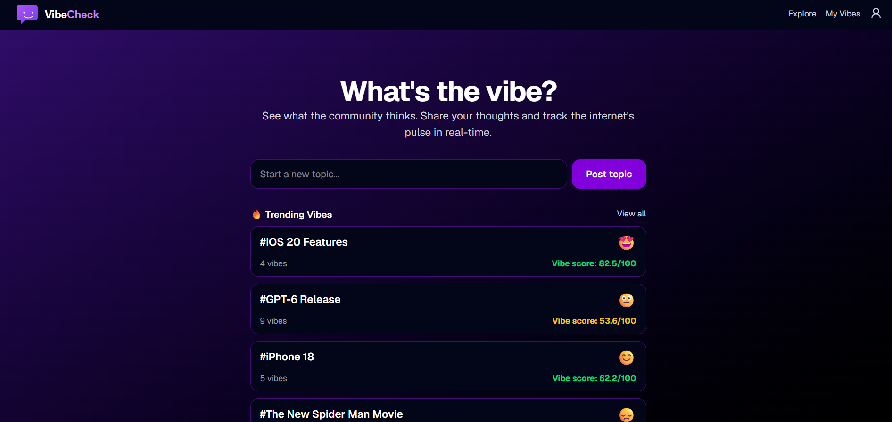
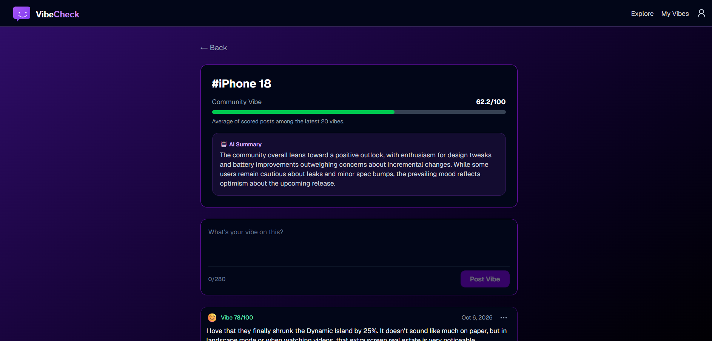
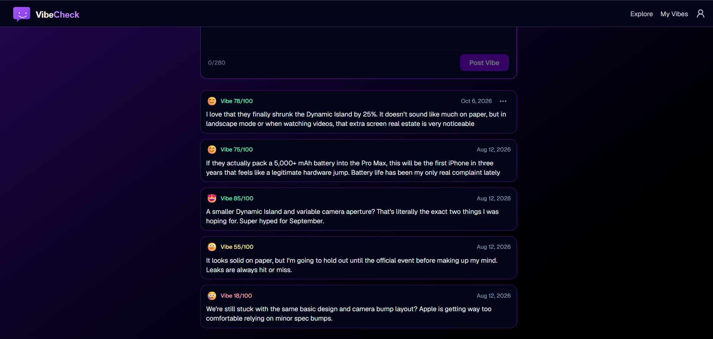
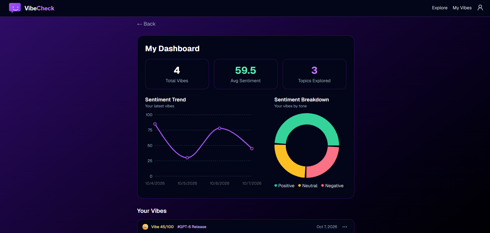
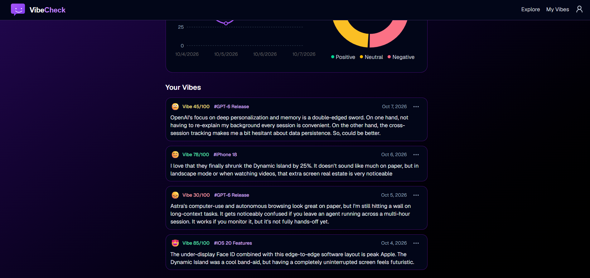

# VibeCheck

VibeCheck is a full-stack community opinions platform where users can create topics, share their opinions, and explore how people feel about different discussions.

The application analyzes submitted posts to generate sentiment scores, allowing users to quickly understand the overall vibe of a topic while also exploring individual community responses.

**Live Demo:** [https://lets-vibe-check.vercel.app](https://lets-vibe-check.vercel.app)  
**GitHub Repository:** [https://github.com/mh5034/vibecheck](https://github.com/mh5034/vibecheck)

## Screenshots

### Home Page




### Topic Discussion





### Dashboard





## Features

- **Community Topics** — Browse discussions created by users across different subjects.
- **Create Topics** — Authenticated users can start new discussions for the community.
- **Share Vibes** — Users can post their opinions and reactions to topics.
- **Sentiment Analysis** — Submitted posts are analyzed and assigned sentiment scores.
- **Topic Vibe Score** — Topic sentiment is calculated from recent community responses to provide an overall view of how people feel.
- **Sentiment Dashboard** — View personal activity, average sentiment, explored topics, sentiment trends, and sentiment distribution.
- **My Vibes** — Authenticated users can view their previous posts and return to their associated topics.
- **User Authentication** — Secure account-based access to personalized features.
- **Demo Account** — Visitors can explore authenticated functionality without creating an account.
- **Responsive Interface** — Designed for desktop and mobile devices.

## Tech Stack

### Frontend

- React
- TypeScript
- Vite
- React Router
- Tailwind CSS
- shadcn/ui
- Base UI
- Recharts
- Lucide React
- Axios

### Backend

- FastAPI
- Python
- PostgreSQL
- JWT Authentication
- REST API

### Development & Deployment

- Docker
- Docker Compose
- Vercel
- Render

## How It Works

1. Users browse existing community topics or create a new topic.
2. Authenticated users submit their opinions as posts.
3. The backend processes the submitted post and performs sentiment analysis.
4. A sentiment score is associated with the post.
5. Recent sentiment scores are used to calculate the overall vibe of a topic.
6. Topic pages display community posts alongside the current vibe score.
7. The personal dashboard summarizes the user's activity and sentiment history.

## Architecture

VibeCheck uses a separated frontend and backend architecture.

The React frontend is responsible for the user interface, routing, client-side state, and communication with the API. The FastAPI backend handles authentication, business logic, sentiment processing, and database operations.

```text
User
 │
 ▼
React / Vite
 │
 ├── React Router
 ├── Authentication Context
 ├── Axios API Client
 └── Recharts
       │
       │ HTTP / REST API
       ▼
    FastAPI
       │
       ├── Authentication
       ├── Business Logic
       ├── Sentiment Analysis
       └── Database Operations
                │
                ▼
           PostgreSQL
```

This separation allows the frontend and backend to be developed, deployed, and scaled independently.

## Frontend

The frontend is built as a React single-page application using Vite and React Router.

Reusable components are used throughout the application for topics, posts, navigation, sentiment visualization, loading states, and other interface elements.

Axios provides a centralized API client for communication with the FastAPI backend.

## Backend API

The backend is built with FastAPI and exposes REST API endpoints consumed by the React frontend.

It handles operations such as:

- User authentication
- Topic creation and retrieval
- Post creation and retrieval
- Sentiment processing
- Dashboard data
- User-specific content

FastAPI also provides structured request and response handling between the frontend and backend.

## Authentication

VibeCheck uses token-based authentication to manage authenticated sessions.

The frontend maintains authentication state through a React authentication context, while protected backend endpoints verify user authorization before allowing access to user-specific operations.

Authenticated functionality includes creating topics, submitting vibes, viewing personal activity, and accessing dashboard information.

A demo account is also available so visitors can explore these features without creating their own account.

## Sentiment Analysis

Posts submitted to VibeCheck are analyzed to determine their sentiment.

Each successfully analyzed post receives a sentiment score that can be categorized as positive, neutral, or negative.

Topic-level sentiment is calculated using recent available post scores, allowing the displayed vibe to reflect current community opinion rather than relying only on older discussions.

If sentiment analysis is unavailable for a post, the application handles the missing result without assigning an artificial sentiment score.

## Dashboard

The dashboard gives authenticated users an overview of their activity.

It includes:

- Total vibes submitted
- Average sentiment score
- Number of topics explored
- Sentiment trend across recent vibes
- Positive, neutral, and negative sentiment breakdown

Interactive charts built with Recharts provide a visual summary of the user's sentiment history and distribution.

## Responsive Design

VibeCheck is designed to work across desktop and mobile screen sizes.

Navigation, topic creation, search, dashboard statistics, charts, posts, and other interface elements adapt to smaller screens to maintain usability across devices.

## Docker

Docker Compose is used to provide a consistent local development environment.

The development environment includes separate services for:

- Frontend
- FastAPI backend
- PostgreSQL database

This allows the full application stack to be started together while keeping each service isolated.

## Running Locally

### 1. Clone the Repository

```bash
git clone [ADD YOUR GITHUB REPOSITORY URL]
cd vibecheck
```

### 2. Configure Environment Variables

Create the required environment files for the frontend and backend.

Configure variables for:

- Database connection
- Authentication
- Sentiment analysis
- Frontend API URL
- Other required backend services

Do not commit environment files or private credentials to the repository.

### 3. Start with Docker Compose

```bash
docker compose up --build
```

This starts the frontend, backend, and PostgreSQL services.

### 4. Open the Application

The frontend development server can then be accessed at:

```text
http://localhost:3000
```

## Production

VibeCheck uses separate frontend and backend deployments.

- **Frontend:** Vercel
- **Backend:** Render
- **Database:** PostgreSQL

The frontend communicates with the deployed FastAPI REST API, allowing the frontend and backend services to operate independently.

## Security

Authentication and authorization are enforced by the backend rather than relying only on frontend controls.

Protected API operations verify authenticated users before allowing access to user-specific resources.

Sensitive credentials, database configuration, authentication secrets, and external service credentials are stored using environment variables and are not exposed through the frontend.

## Future Improvements

- More advanced sentiment analytics
- Sentiment trends over longer time periods
- Additional dashboard insights
- Topic categories and improved discovery
- Improved search and filtering
- Notifications for topic activity
- More advanced moderation tools
- Improved production monitoring and error handling

## Author

**Mohammad Hadi Elabed**

Full-Stack Developer / Software Engineer
